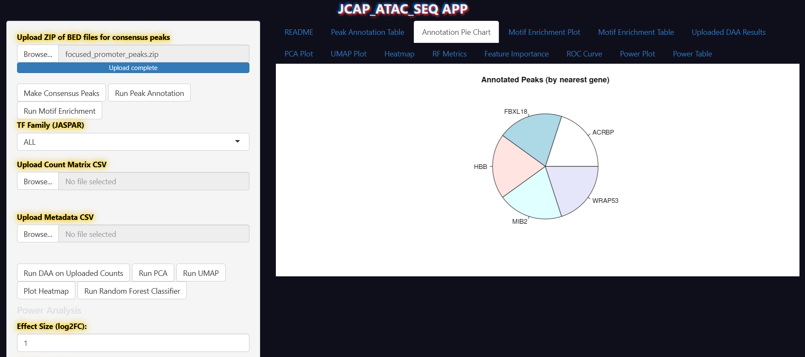
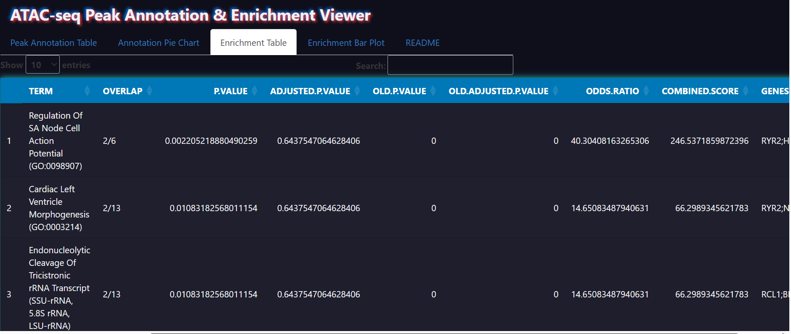
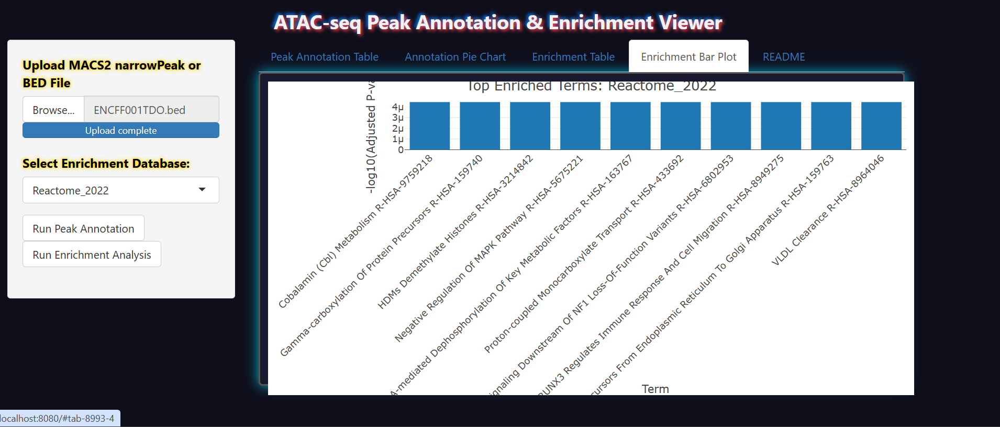

# 🔬 ATAC-seq Peak Annotation & Enrichment Viewer

This interactive **R Shiny** app allows you to upload **MACS2 `.narrowPeak`** files, annotate peaks using **ChIPseeker**, and visualize functional enrichment with **enrichR** — all without touching a single line of R.

💡 Built with love in R, glowy CSS, and battle-tested on real-world ATAC-seq data.

---

## 📸 App Screenshots

### 🧬 Peak Annotation Pie Chart


### 📑 Enrichment Table


### 📊 Peak Annotation Table


### 🔬 Enrichment Bar Plot



## 🚀 Features

- 📂 Upload MACS2 `.narrowPeak` files
- 🧬 Annotate peaks via `ChIPseeker`
- 📊 Visualize annotation (tables, pie charts)
- 🧠 Run functional enrichment (GO, KEGG, Reactome via `enrichR`)
- 📦 Fully containerized via Docker (no Shiny Server needed)
- 🖥️ HPC/local compatible — cloud optional

---

## 📦 Requirements (if running outside Docker)

Install the required R packages manually:
```r
install.packages(c(
  "shiny", "shinyjs", "plotly", "DT", "enrichR", "clusterProfiler"
))
if (!requireNamespace("BiocManager", quietly=TRUE)) install.packages("BiocManager")
BiocManager::install(c(
  "ChIPseeker", "GenomicRanges", "TxDb.Hsapiens.UCSC.hg38.knownGene",
  "org.Hs.eg.db"
))

🧪 How to Run the App
🔁 Option 1: Local (with Docker)
type bash in your terminal  then run:

git clone https://github.com/your-user/ATAC_APP.git
cd ATAC_APP
bash run.sh
Open in browser: http://localhost:8787


This launches the app via Docker — no setup needed.

💻 Option 2: Local (RStudio)


# From inside R
setwd("path/to/ATAC_APP")
library(shiny)
runApp(".")


🧠 Option 3: Singularity (for HPC clusters)
If you're on an HPC system using Singularity or Apptainer:

📦 Build the container

singularity build atac-shiny.sif Singularity.def

🚀 Run the app

singularity run --bind $(pwd):/mnt atac-shiny.sif

🌐 Access in browser

# On remote HPC, port forward:
ssh -L 8080:localhost:8080 youruser@cluster
# Then open:
http://localhost:8080


🎛️ How to Use the App
Upload a MACS2 .narrowPeak file

Click "Upload"
Load your peaks
Run Peak Annotation

Click "Run Peak Annotation"
Annotates peaks with ChIPseeker
Run Enrichment

Select DB: GO / KEGG / Reactome
Click "Run Enrichment Analysis"


📊 Tab Overview

Tab	Description
Peak Annotation Table	Searchable table of annotated peaks with CSV download
Annotation Pie Chart	Visual pie chart of peak distribution
Enrichment Table	Table of enriched terms (CSV exportable)
Enrichment Bar Plot	Top 10 enriched terms visualized with plotly
README	Embedded usage guide inside app

🛠️ Developer Notes
🔒 Internal Error Logging
All errors logged to error_log.txt
For long-term use, schedule email_log.R to:
Email logs to dev at midnight
Archive old logs into /logs/

📁 Folder Structure
ATAC_APP/
├── app.R                  # Main app
├── email_log.R           # Internal dev monitoring (cron/timer)
├── www/
│   └── fairy_tail.css    # Glowy anime-themed UI
├── error_log.txt         # Autogenerated
├── logs/                 # Log archives (optional)
├── run.sh                # Docker launcher script
├── Dockerfile            # Full containerized environment
└── README.md             # You're here

👨‍🔬 Citation / Credit
If you use this in a paper or lab project, a shoutout or link back is appreciated 🙏
MIT License. Fork away.

🧠 FAQ
Q: Why isn’t this deployed on the cloud?
A: This app uses Bioconductor packages (e.g., Rhtslib, ChIPseeker, TxDb) that require native compilation and large genomic data libraries. These do not play well with serverless environments like Cloud Run, but work great on Docker/HPC setups.

Q: Can I run this on an HPC?
✅ Yes. This app is fully portable via Docker or Singularity.


Built a scientists, for scientists.
🧬🖥️ Make ATAC analysis suck less.


