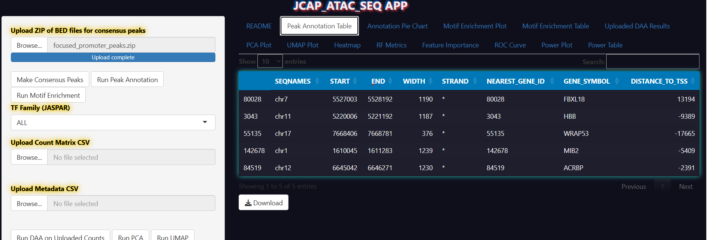

# 🔬 ATAC-seq Peak Annotation & Enrichment Viewer

This interactive **R Shiny** app allows you to upload **MACS2 `.narrowPeak`** files, annotate peaks using **ChIPseeker**, and visualize functional enrichment with **enrichR** — all without touching a single line of R.

💡 Built with love in R, glowy CSS, and battle-tested on real-world ATAC-seq data.

---

## 📚 Table of Contents

- [📸 App Screenshots](#-app-screenshots)
- [🚀 Features](#-features)
- [🧪 Sample Data](#-sample-data)
- [📦 Requirements](#-requirements-if-running-outside-docker)
- [🧪 How to Run the App](#-how-to-run-the-app)
- [🎛️ How to Use the App](#-how-to-use-the-app)
- [📊 Tab Overview](#-tab-overview)
- [🛠️ Developer Notes](#-developer-notes)
- [📁 Folder Structure](#-folder-structure)
- [👨‍🔬 Citation / Credit](#-citation--credit)
- [🧠 FAQ](#-faq)

---

## 📸 App Screenshots

### 🧬 Peak Annotation Pie Chart


### 📑 Enrichment Table


### 📊 Peak Annotation Table


### 🔬 Enrichment Bar Plot


---

## 🚀 Features

- 📂 Upload MACS2 `.narrowPeak` files
- 🧬 Annotate peaks via `ChIPseeker`
- 📊 Visualize annotation (tables, pie charts)
- 🧠 Run functional enrichment (GO, KEGG, Reactome via `enrichR`)
- 📦 Fully containerized via Docker (no Shiny Server needed)
- 🖥️ HPC/local compatible — cloud optional

---

## 🧪 Sample Data

A sample **ATAC-seq narrowPeak file** is provided for testing purposes.

- 📁 Location: `sample_data/ENCFF002CUU.bed`
- 🧬 Source: ENCODE Project – GM12878 cell line (hg19 assembly)  
  [ENCFF002CUU – IDR-thresholded peaks](https://www.encodeproject.org/files/ENCFF002CUU/)

This file can be used to test the app’s upload and visualization functions without needing to preprocess your own data.

---

## 📦 Requirements (if running outside Docker)

Install the required R packages manually:

```r
install.packages(c(
  "shiny", "shinyjs", "plotly", "DT", "enrichR", "clusterProfiler"
))
if (!requireNamespace("BiocManager", quietly=TRUE)) install.packages("BiocManager")
BiocManager::install(c(
  "ChIPseeker", "GenomicRanges", "TxDb.Hsapiens.UCSC.hg38.knownGene",
  "org.Hs.eg.db"
))

🧪 How to Run the App
🔁 Option 1: Local (with Docker)

in Bash
git clone https://github.com/your-user/ATAC_APP.git
cd ATAC_APP
bash run.sh

Then open in your browser:
http://localhost:8787

💻 Option 2: Local (RStudio)
r

# From inside R
setwd("path/to/ATAC_APP")
library(shiny)
runApp(".")

🧠 Option 3: Singularity (for HPC clusters)
If you're on an HPC system using Singularity or Apptainer:
📦 Build the container

in Bash:
singularity build atac-shiny.sif Singularity.def
🚀 Run the app:
singularity run --bind $(pwd):/mnt atac-shiny.sif

🌐 Access in browser:

# On remote HPC, port forward:
ssh -L 8080:localhost:8080 youruser@cluster
# Then open:
http://localhost:8080

🎛️ How to Use the App
Upload a MACS2 .narrowPeak file

Click "Upload"

Load your peaks

Run Peak Annotation

Click "Run Peak Annotation"

Annotates peaks with ChIPseeker

Run Enrichment

Select DB: GO / KEGG / Reactome

Click "Run Enrichment Analysis"

📊 Tab Overview
Tab	Description
Peak Annotation Table	Searchable table of annotated peaks with CSV download
Annotation Pie Chart	Visual pie chart of peak distribution
Enrichment Table	Table of enriched terms (CSV exportable)
Enrichment Bar Plot	Top 10 enriched terms visualized with plotly
README	Embedded usage guide inside app

🛠️ Developer Notes
🔒 Internal Error Logging
All errors are logged to error_log.txt.
For long-term use, schedule email_log.R to:

Email logs to dev at midnight

Archive old logs into /logs/

📁 Folder Structure

ATAC_APP/
├── app.R                  # Main app
├── email_log.R           # Internal dev monitoring (cron/timer)
├── www/
│   └── fairy_tail.css    # Glowy anime-themed UI
├── error_log.txt         # Autogenerated
├── logs/                 # Log archives (optional)
├── run.sh                # Docker launcher script
├── Dockerfile            # Full containerized environment
├── sample_data/
│   └──  ENCFF002CUU.bed # Example input file
└── README.md             # You're here
 Citation / Credit
If you use this in a paper or lab project, a shoutout or link back is appreciated 🙏
MIT License. Fork away.

🧠 FAQ
Q: Why isn’t this deployed on the cloud?
A: This app uses Bioconductor packages (e.g., Rhtslib, ChIPseeker, TxDb) that require native compilation and large genomic data libraries. These do not play well with serverless environments like Cloud Run, but work great on Docker/HPC setups.

Q: Can I run this on an HPC?
✅ Yes. This app is fully portable via Docker or Singularity.

Built by scientists, for scientists.
🧬🖥️ Make ATAC analysis suck less.


